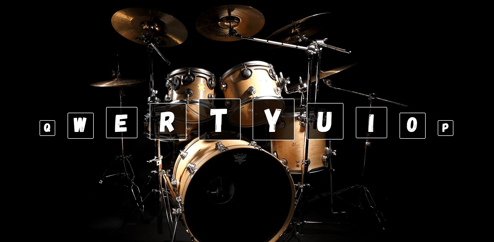

Что то вроде онлайн барабанной установки, на экране указаны клавиши верхнего ряда клавиатуры, за каждой закреплен какой то звук.

(просто практика для понимания обработчиков событий, навигации по DOM дереву в нативном js)
